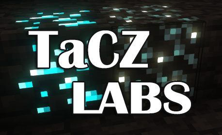

`TaCZ:Labs` 为`永恒枪械工坊：零`的一个附属

此模组包含了一些作者的想法，同时也会给予玩家很多可配置选项，其中既有面向玩家的内容，也有一些可能对整合包作者有帮助的选项。无论是自己玩还是加到整合包中都是可以的！

你是否发现 TaCZ 无法跑射？没关系，这个模组目前实现了这个简单的功能。

TaCZ: Labs 依照游戏 PUBG 为 TaCZ 制作了一套全新的准星！新准星拥有丝滑的动态效果，同时拥有丰富的配置选项供你调整，包括最重要的ARGB调色！不喜欢？你完全可以把它变成静态的或者关掉！你也能为每把枪单独选择准星。

本 Mod 使用与 `TaCZ` 同样的 `GPLv3` 协议。

敬请期待 :)

`# 更新日志`【目前已实现的功能】：

- `v1.0.0`：疾跑时仍可开枪，开枪会中断疾跑（而非不理会左键）
- `v1.1.0`：加入了新准星
- `v1.1.1`：现在你可以单独为每把枪选择使用 TaCZ 原版准星